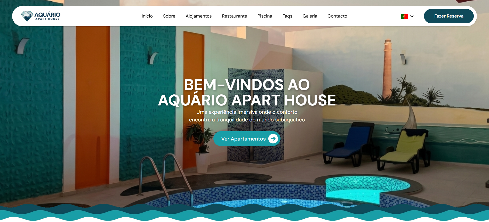

<div align="center">
  
</div>

# 🐟 Aquário Apart House - Boavista, Cabo Verde

O **Aquário Apart House** é um website institucional moderno desenvolvido em **React.js**, criado para apresentar um espaço de hotelaria exclusivo localizado na ilha da Boavista, em Cabo Verde.

O projeto destaca alojamentos, restaurante-bar com aquário integrado, piscina temática e experiências visuais imersivas. O website é totalmente internacionalizado para facilitar a navegação de visitantes de diferentes países.

---

## 🚀 Funcionalidades Principais

- 🏡 **Apresentação de Alojamentos**  
  Secções detalhadas com informações sobre os apartamentos (`Alojamentos.jsx`, `AllApt.jsx`).

- 🐟 **Restaurante-Bar com Aquário Integrado**  
  Experiência gastronómica única com ambiente imersivo (`Restaurante.jsx`).

- 🐢 **Piscina em Formato de Tartaruga**  
  Área de lazer icónica apresentada de forma visual (`Piscina.jsx`).

- 🌍 **Internacionalização Completa (i18n)**  
  Suporte para 4 idiomas:
  - Português (PT)
  - Inglês (EN)
  - Francês (FR)
  - Italiano (IT)

- 🖼️ **Galeria & Testemunhos**  
  Fotos de alta qualidade e avaliações de clientes (`Galeria.jsx`, `Testemunhos.jsx`).

- 🗺️ **Localização em Tempo Real**  
  Integração com Google Maps API (`MapComponent.jsx`).

- 📩 **Formulário de Contacto**  
  Sistema de contacto direto para reservas e informações via Whatsapp (`Contact.jsx`).

---

## 🛠️ Tecnologias Utilizadas

- ⚛️ [React.js](https://reactjs.org/) (com Vite)
- 🌐 [react-i18next](https://react.i18next.com/)
- 🗺️ [Google Maps API](https://developers.google.com/maps)
- 🔀 [React Router DOM](https://reactrouter.com/)
- 🎨 CSS3 / Componentização moderna

---

## 📂 Estrutura do Projeto

```text
AQUARIOAPARTHOUSE/
├── public/
├── src/
│   ├── assets/
│   ├── components/
│   │   ├── AllApt.jsx
│   │   ├── Alojamentos.jsx
│   │   ├── Contact.jsx
│   │   ├── Footer.jsx
│   │   ├── Footer02.jsx
│   │   ├── Galeria.jsx
│   │   ├── Hero.jsx
│   │   ├── Hero.css
│   │   ├── LanguageSwitcher.jsx
│   │   ├── MapComponent.jsx
│   │   ├── NavBar.jsx
│   │   ├── NavBar02.jsx
│   │   ├── NavLinks.jsx
│   │   ├── NavLinks02.jsx
│   │   ├── Piscina.jsx
│   │   ├── Preparado.jsx
│   │   ├── Restaurante.jsx
│   │   ├── ScrollToTop.jsx
│   │   ├── Sobre.jsx
│   │   └── Testemunhos.jsx
│   ├── locales/
│   │   ├── en/translation.json
│   │   ├── fr/translation.json
│   │   ├── it/translation.json
│   │   └── pt/translation.json
│   ├── pages/
│   │   ├── Apartamentos.jsx
│   │   └── Homepage.jsx
│   ├── routes/
│   │   └── AppRoutes.jsx
│   ├── App.jsx
│   ├── App.css
│   ├── i18n.js
│   ├── index.css
│   └── main.jsx
├── .env
├── .gitignore
├── eslint.config.js
├── index.html
├── package.json
├── package-lock.json
├── vite.config.js
└── README.md
```

## 🧭 Estrutura das Páginas

### Homepage (`Homepage.jsx`)

Página principal focada em experiência imersiva e storytelling:

- `<NavBar />` + `<LanguageSwitcher />` → Navegação global e troca de idiomas  
- `<Hero />` → Apresentação inicial de impacto visual  
- `<Sobre />` → Conceito do projeto e localização  
- `<Alojamentos />` → Preview dos apartamentos disponíveis  
- `<Restaurante />` → Experiência gastronómica com aquário  
- `<Piscina />` → Destaque visual da piscina temática  
- `<Testemunhos />` → Avaliações e prova social  
- `<Galeria />` → Imagens do espaço e ambiente  
- `<Contact />` → Formulário de contacto + mapa (Google Maps API)  
- `<Preparado />` + `<Footer />` → Encerramento e links adicionais  

---

### Página de Apartamentos (`Apartamentos.jsx`)

Página focada em conversão direta para reservas:

- `<NavBar />` + `<LanguageSwitcher />` → Navegação global e troca de idiomas  
- `<AllApt />` → Listagem completa dos apartamentos disponíveis  
`<Footer />` → Encerramento e links adicionais  

---

## ⚙️ Instalação Local

Siga os passos abaixo para clonar, configurar e executar o projeto localmente na sua máquina de desenvolvimento:

### 1. Pré-requisitos
Antes de iniciar, garanta que tem instalado na sua máquina:
* **Node.js (Ambiente de Execução):** Necessário para que o **Vite** consiga rodar o servidor de desenvolvimento e compilar o projeto.
* **NPM (Gestor de Pacotes):** Já vem incluído com o Node.js; necessário para instalar as bibliotecas do projeto.
* **Git:** Para clonar o repositório do projeto.
* **Chave de API do Google Maps:** Para carregar o mapa interativo em Boavista.

---

### Dependências do Projeto

O comando de instalação irá descarregar automaticamente os seguintes pacotes mapeados para este ecossistema:

#### Dependências de Produção (`dependencies`)
* **React & React DOM (`^19.2.5`):** Biblioteca base da interface.
* **React Router Dom (`^7.15.0`) & React Router Hash Link (`^2.4.3`):** Gestão de rotas e scroll suave.
* **Google Maps API (`@react-google-maps/api ^2.20.8`):** Integração com o mapa dinâmico.
* **Internacionalização (i18n):** `i18next (^26.2.0)`, `react-i18next (^17.0.8)` e `i18next-browser-languagedetector (^8.2.1)`.
* **Ícones:** `lucide-react (^1.14.0)` e pacotes `@fortawesome` (FontAwesome `^7.2.0` / `^3.3.1`).

#### Dependências de Desenvolvimento (`devDependencies`)
* **Vite (`^8.0.10`) & @vitejs/plugin-react (`^6.0.1`):** Servidor local e compilador rápido.
* **Tailwind CSS (`^4.3.0`) & @tailwindcss/vite (`^4.3.0`):** Framework de estilos v4 injetado no Vite.
* **PostCSS (`^8.5.14`) & Autoprefixer (`^10.5.0`):** Processamento de estilos e compatibilidade de navegadores.
* **ESLint (`^10.2.1`):** Padronização e linter do código.

---

### 2. Clonar o Repositório
Abra o terminal na pasta onde deseja guardar o projeto e execute:
```bash
git clone [https://github.com/elviopatrickdev/aquario_apart_house.git](https://github.com/elviopatrickdev/aquario_apart_house.git)
cd aquario_apart_house